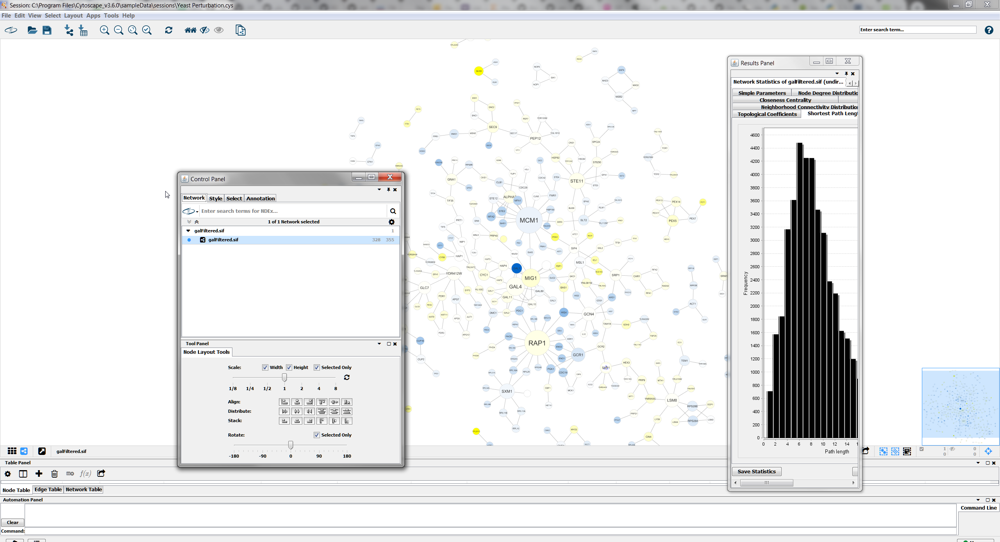

# Panels

**Panels** are floatable/dockable panels designed to cut down on the number of pop-up windows within Cytoscape 
and to create a more unified user experience. 

There are five panels that can be visible or hidden:
- Control Panel (left)
- Tool Panel (bottlom left)
- Table Panel (bottom right)
- Results Panel (right)
- Automation Panel (bottom)

Each panel typically contains multiple tabs. For example the **Control Panel** contains at a minimum the **Network**,
**Style**, **Filter** and **Annotation** tabs. The **Table Panel** contains the **Node Table**, **Edge Table** and
**Network Table** tabs. Analysis results from _Analyzer_ (**Tools → Analyze Network**) 
are shown in **Results Panel**. Installed Apps may add additional tabs.

These panels can compete for valuable screen real-estate (e.g. by making the network view too small), so it is important to manage each panel's state and size properly and acconding to the user's needs.
You can take advantage of these 5 panel states in order to manage the available screen real-estate:
- **Hidden:** A panel can be totally removed from the screen if you find it unnecessary. To do that, just uncheck the corresponding option under the **View** menu (e.g. uncheck **View → Show Results Panel** to hide the _Results Panel_). When a panel is hidden, its tabs no long appear in the sidebar, so in order to show the panel again, you have to check the same menu option. Alternatively, you can right-click an empty space on any sidebar to hide/show a panel.
- **Minimized:** Tabs still appear on the sidebars... When a tab/icon is clicked, the panel is shown undocked...
- **Docked:** sometimes it can be resized in only one dimension (vertical or horizontal) and it affects the size of adjacent panels...
- **Undocked:** auto-minimize when clicking outside the panel.... can be resized horizontally and vertically without affecting adjacent panels... double-click header to maximize/restore...
- **Floating:** useful with multiple monitors...

For example, in the screenshot below, the Control, Table 
and Results panels are floating:

## Basic Usage

By default, only the **Control Panel** and the **Data Panel** will be shown. The **Results Panel** may appear, 
depending on the mix of Cytoscape apps that you currently have installed. The **Tool Panel** will appear when 
you select the following commands under the **Layout** menu: **Rotate**, **Scale**, and **Align and Distribute**.

In addition, Panels can be floated or docked using icon buttons at the top right corner of each Panel. 
The **Float Window** control 

will undock any panel which is useful when 
you want assign the network as much screen space as possible. To dock the window again, click the 
**Dock Window** icon 

. Clicking the **Hide Panel** 
icon 

will hide the panel; this can be shown again by choosing 
**View → Show** and selecting the relevant panel.
